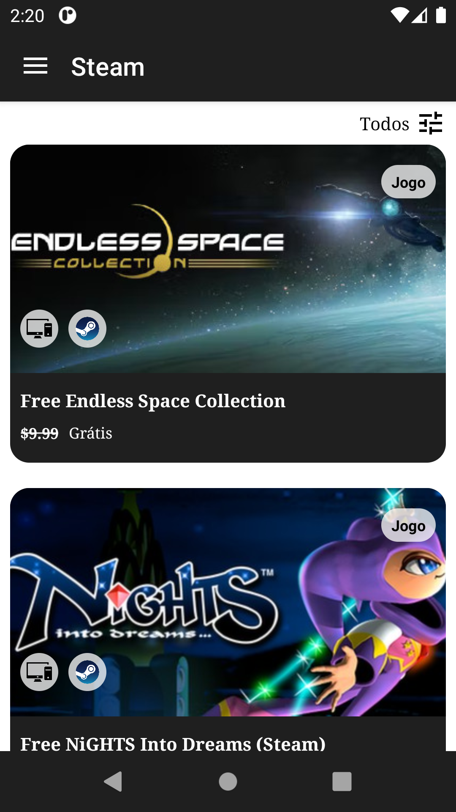
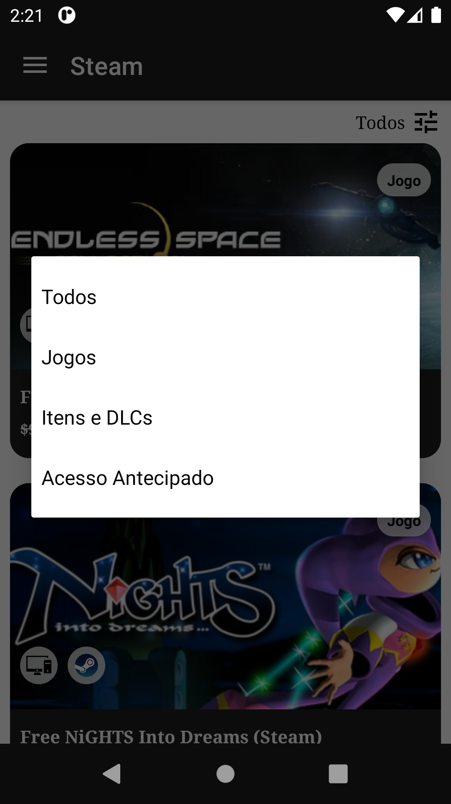
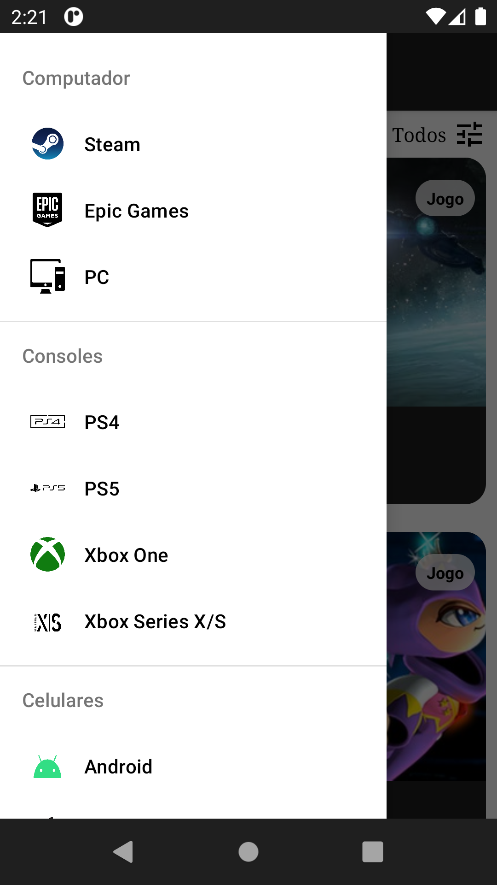
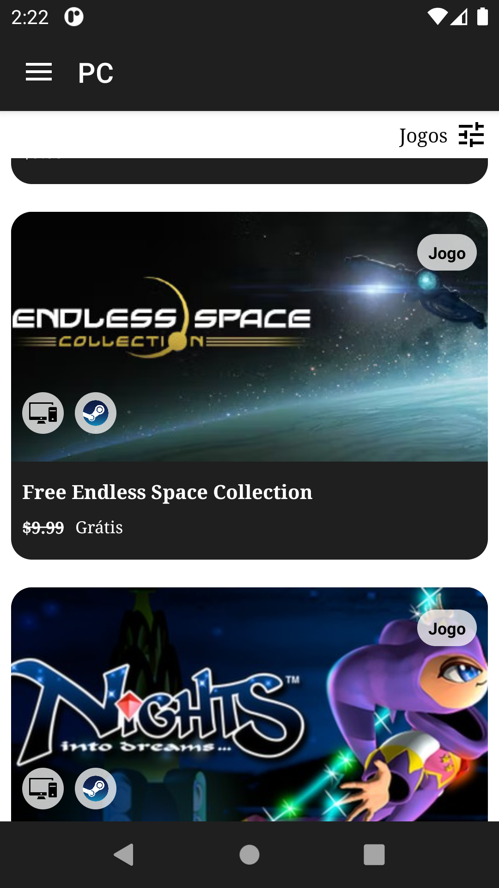

  
# Encontre Jogos Grátis
  

  <i>Encontre Jogos Grátis é um app feito para dispositivos Android utilizando a linguagem de programação <b>JAVA</b>. 
  Com esse app o usuário poderá conferir jogos, itens, DLCs e acessos antecipado que estão gratuitos por tempo limitado nas principais plataformas de jogos do mercado.
 </i>

 

  
  
  
  
  
  

  

